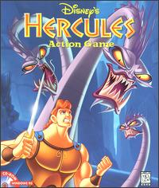

<h1 align="center"> 🌰 HerKoole 🎒 </h1>

<p align="center">
  
</p>

<p align="center">
  
</p>

## Introduction

I want to learn about evolutionary algorithms, so I have created this repository to implement some of its algorithms here.
I am reading the **Introduction to Evolutionary Algorithms** book from Springer.
Repository name comes from [Disney's Hercules](<https://en.wikipedia.org/wiki/Disney's_Hercules_(video_game)>) Video Game.

## Structure

In evolutionary algorithms, we have basic structure to evolve current solution using mutate and crossover
into new solutions to find the optimal one. Each problem needs to have its chromosomes, and each chromosome
represents a solution of that problem.

In `Herkoole` chromosome is an abstract class, and you need to extend it for your solution.
Also, in `Herkoole` there is a class named Model which initiates the evolutionary algorithm,
and you also must have a model for your problem.

## Up and Running

### Knapsack

The knapsack problem is the following problem in combinatorial optimization:

> Given a set of items, each with a weight and a value, determine which items to include in the collection
> so that the total weight is less than or equal to a given limit and the total value is as large as possible.

The following files contain a problem instance:

- knapsack_1.txt
- knapsack_2.txt
- knapsack_3.txt
- knapsack_example.txt

Each file has the following format:

```txt
<number of items> <knapsack capcity>
<item value> <item weight>
<item value> <item weight>
...
<item value> <item weight>
```

consider the example problem as follows:

```txt
10 67
505 23
352 26
458 20
220 18
354 32
414 27
498 29
545 26
473 30
543 27
```

Our knapsack has capacity equals to 67, and we can choose between 10 items.
Let's solve this:

```bash
python main.py -p knapsack -i knapsack_example.txt
```

The best solution that is found by our algorithm is:

```
weight: 67, value: 1077 with fitness: 1077
```

We can run it more to have different solutions:

```
weight: 65, value: 1092 with fitness: 1092
```

```
weight: 54, value: 957 with fitness: 957
```

```
weight: 52, value: 1003 with fitness: 1003
```

As you can see all of these solutions are compatible with
the problem constraints, but they are not optimal.

### Travelling salesman problem

The travelling salesman problem (also called the travelling salesperson problem or TSP) asks the following question:

> Given a list of cities and the distances between each pair of cities, what is the shortest possible route that visits
> each city exactly once and returns to the origin city?

The following files contain a problem instance:

- tsp_data.txt
- tsp_example.txt

Each file has the following format:

```txt
<city id> <city x coordinate> <city y coordinate>
<city id> <city x coordinate> <city y coordinate>
...
<city id> <city x coordinate> <city y coordinate>
```
